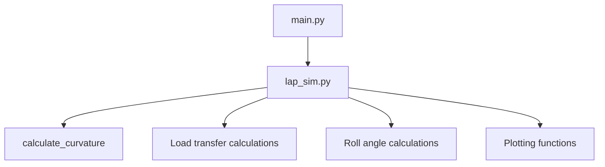

# API Reference - Physics Equations and Code Implementation

This document explains the specific equations used in the simulation and exactly where to find them in the code.

## Table of Contents

1. [Basic Physics Equations Used](#basic-physics-equations-used)
   - [Lateral Acceleration from Track Curvature](#1-lateral-acceleration-from-track-curvature)
   - [Track Curvature Calculation](#2-track-curvature-calculation)
   - [Wheel Load Transfer During Cornering](#3-wheel-load-transfer-during-cornering)
   - [Roll Angle Calculation](#4-roll-angle-calculation)
   - [Magic Formula Tire Model](#5-magic-formula-tire-model)

2. [Function Locations in Codebase](#function-locations-in-codebase)
   - [Core Simulation Functions](#core-simulation-functions)
   - [Physics Calculation Functions](#physics-calculation-functions)
   - [Vehicle Configuration Functions](#vehicle-configuration-functions)
   - [Data Loading Functions](#data-loading-functions)
   - [Visualization Functions](#visualization-functions)
   - [Output and Utility Functions](#output-and-utility-functions)

3. [How Functions Work Together](#how-functions-work-together)
   - [Main Simulation Workflow](#main-simulation-workflow)
   - [Physics Function Chain](#physics-function-chain)
   - [Data Flow](#data-flow)

4. [Detailed Function Reference](#detailed-function-reference)
   - [Main Simulation Functions](#main-simulation-functions-1)
   - [Vehicle Configuration Functions](#vehicle-configuration-functions-1)
   - [Physics Calculation Functions](#physics-calculation-functions-inline-in-mainpy)
   - [Data Loading Functions](#data-loading-functions-1)
   - [Visualization Functions](#visualization-functions-1)
   - [Utility Functions](#utility-functions)

5. [Function Dependencies](#function-dependencies)
   - [Dependency Chain](#dependency-chain)
   - [Data Flow Between Functions](#data-flow-between-functions)

6. [How to Find Specific Calculations](#how-to-find-specific-calculations)

---

## Basic Physics Equations Used

### 1. Lateral Acceleration from Track Curvature

**The Equation**: `a_lateral = v² × κ`
- `v` = vehicle speed (ft/s)
- `κ` = track curvature (1/ft)
- `a_lateral` = lateral acceleration (ft/s²)

**Where to find it**: `lap_simulation/lap_sim.py` around line 45

**What it means**: The faster you go or the tighter the turn, the more sideways force you need. If you need more force than the tires can provide, you slide off the track.

### 2. Track Curvature Calculation

**The Equation**: `κ = |x'y'' - y'x''| / (x'² + y'²)^(3/2)`
- This calculates how sharp each turn is from the track coordinates

**Where to find it**: `lap_simulation/lap_sim.py` around line 30

**What it means**: This tells us how sharp each part of the track is. Straight sections have curvature ≈ 0, tight hairpins have high curvature.

### 3. Wheel Load Transfer During Cornering

**The Equation**: `ΔF_lateral = (a_y × m × h) / t`
- `a_y` = lateral acceleration (g)
- `m` = vehicle mass (kg)
- `h` = center of gravity height (m)
- `t` = track width (m)

**Where to find it**: `main.py` around line 160

**What it means**: When you turn, the car "leans" and weight shifts to the outside wheels. Higher center of gravity = more weight transfer.

### 4. Roll Angle Calculation

**The Equation**: `φ = (F_y × h) / (K_φ_front + K_φ_rear)`
- `F_y` = lateral force (N)
- `h` = CG height above roll center (m)
- `K_φ` = roll stiffness (Nm/rad)

**Where to find it**: `main.py` around line 250

**What it means**: Stiffer anti-roll bars reduce body roll. Too much roll affects how the tires contact the road.

### 5. Magic Formula Tire Model

**The Equation**: `F_y = D × sin(C × arctan(B × α))`
- `F_y` = lateral tire force (N)
- `D` = peak force coefficient
- `C` = shape factor
- `B` = stiffness factor
- `α` = slip angle (rad)

**Where to find it**: `lap_simulation/tire_model.py` around line 20

**What it means**: This is how tire engineers model tire behavior. The force builds up as you turn the wheel, reaches a peak, then drops off if you turn too hard.

---

## Function Locations in Codebase

This section provides the exact file locations for all functions used in the simulation.

### Core Simulation Functions

| Function | File Location | Purpose |
|----------|---------------|---------|
| `lap_sim(track_file, base_dir)` | `lap_simulation/lap_sim.py` | Main lap simulation function that calculates accelerations for the entire track |
| `main()` | `main.py` | Entry point that runs the complete simulation and creates output plots |
| `load_track_data_quiet()` | `main.py` | Loads track data from Excel files without verbose logging |

### Physics Calculation Functions

| Function | File Location | Line Range | Purpose |
|----------|---------------|------------|---------|
| `calculate_load_transfer()` | `main.py` | ~150-180 | Calculates how weight shifts between wheels during cornering and braking |
| `calculate_curvature()` | `lap_simulation/lap_sim.py` | ~30-40 | Computes track curvature from coordinate data using differential geometry |
| `magic_formula_lateral()` | `lap_simulation/tire_model.py` | ~20+ | Calculates lateral tire force using the Pacejka Magic Formula |
| `calculate_roll_angle()` | `main.py` | ~240-260 | Computes vehicle body roll angle from lateral acceleration and suspension properties |

### Vehicle Configuration Functions

| Function | File Location | Purpose |
|----------|---------------|---------|
| `get_vehicle_config()` | `vehicle_config.py` | Returns dictionary with all vehicle parameters (mass, geometry, suspension) |
| `get_powertrain_config()` | `vehicle_config.py` | Returns engine and transmission parameters |
| `print_vehicle_summary()` | `vehicle_config.py` | Displays vehicle configuration summary |

### Data Loading Functions

| Function | File Location | Purpose |
|----------|---------------|---------|
| `load_comprehensive_track_data()` | `visualization/plot_racing_track.py` | Loads track coordinates and racing line data from multiple sources |
| Data loading utilities | `lap_simulation/data_loader.py` | Contains functions for loading Excel files and MATLAB .mat files |

### Visualization Functions

| Function | File Location | Purpose |
|----------|---------------|---------|
| `plot_track_with_velocity()` | `visualization/plot_racing_track.py` | Creates track layout plots with velocity color coding |
| `create_racing_line_plot()` | `visualization/plot_racing_track.py` | Generates racing line visualization with track boundaries |

### Output and Utility Functions

| Function | File Location | Purpose |
|----------|---------------|---------|
| `get_plot_path()` and `get_data_path()` | `lap_simulation/output_utils.py` | Manages file paths for saving plots and data |
| `save_simulation_results()` | `lap_simulation/output_utils.py` | Exports simulation data to CSV files |

---

## How Functions Work Together

### Code Execution Flow When Running main.py

When you execute `python main.py`, here's exactly what happens step by step:

#### **Phase 1: Initialization (Lines ~25-50)**
1. **Import Dependencies**: 
   - Loads numpy, pandas, matplotlib for calculations and plotting
   - Imports custom modules: `vehicle_config`, `lap_sim`, `output_utils`, `plot_racing_track`

2. **Load Vehicle Configuration**:
   - Calls `get_vehicle_config()` from `vehicle_config.py`
   - Returns dictionary with mass (250 kg), CG height (0.3 m), track widths, roll stiffness values
   - These parameters will be used throughout all physics calculations

3. **Set Up File Paths**:
   - Defines base directory for finding Excel track files
   - Sets up paths to `Endurance_Coordinates_1.xlsx` and `Autocross_Coordinates_2.xlsx`

#### **Phase 2: Core Physics Simulation (Lines ~50-80)**
4. **Load Track Data**:
   - Calls `load_track_data_quiet()` which internally calls `load_comprehensive_track_data()`
   - Reads Excel file with X,Y coordinates of the track layout
   - Validates data format and handles any missing points

5. **Run Lap Simulation**:
   - Calls `lap_sim(endurance_coords, base_dir)` from `lap_simulation/lap_sim.py`
   - **Inside lap_sim()**: 
     - Calculates track curvature using differential geometry: κ = |x'y'' - y'x''| / (x'² + y'²)^(3/2)
     - Converts curvature to lateral acceleration: a_lateral = v² × κ
     - Generates realistic longitudinal acceleration patterns
     - Creates distance array for the entire track
   - **Returns**: Three arrays - `A_long_g[]`, `A_lat_g[]`, `distance[]`

#### **Phase 3: Load Transfer Analysis (Lines ~80-180)**
6. **Calculate Individual Wheel Loads**:
   - For each point around the track (loop through all array indices):
     - **Base Load**: Each wheel starts with 1/4 of total vehicle weight
     - **Lateral Transfer**: `lat_transfer = A_lat_g[i] × mass × 0.224809 × cg_height_factor`
     - **Longitudinal Transfer**: `long_transfer = A_long_g[i] × mass × 0.224809 × cg_height_factor`
     - **Individual Wheels**:
       - Front Left: `base_load - lat_transfer + long_transfer`
       - Front Right: `base_load + lat_transfer + long_transfer`
       - Rear Left: `base_load - lat_transfer - long_transfer`
       - Rear Right: `base_load + lat_transfer - long_transfer`

#### **Phase 4: Roll Angle Calculations (Lines ~240-260)**
7. **Calculate Vehicle Body Roll**:
   - For each track point: `roll_angle = (A_lat_g × W × H) / (Kphi_front + Kphi_rear)`
   - Uses lateral acceleration, vehicle weight, CG height, and total roll stiffness
   - Converts from radians to degrees for practical interpretation

#### **Phase 5: Data Visualization (Lines ~180-300)**
8. **Generate Acceleration Plots**:
   - Creates 2-panel subplot: longitudinal vs lateral acceleration
   - Plots both arrays against distance traveled
   - Saves as `acceleration_plots.png` using `get_plot_path()`

9. **Generate Load Transfer Plots**:
   - Creates 4-panel subplot showing individual wheel loads
   - Each panel shows one wheel's load variation throughout the lap
   - Saves as `corner_loads.png`

10. **Generate Roll Angle Plots**:
    - Single plot showing body roll angle vs distance
    - Saves as `roll_angles.png`

11. **Generate Track Layout Plots**:
    - Calls plotting functions from `visualization/plot_racing_track.py`
    - Creates track layout visualizations with velocity profiles

#### **Phase 6: Data Export (Lines ~300+)**
12. **Export Simulation Data**:
    - Calls `save_simulation_results()` from `output_utils.py`
    - Creates CSV file with all calculated data
    - Includes metadata header with simulation parameters

#### **Phase 7: Completion**
13. **Print Summary**:
    - Displays completion message with output file locations
    - Shows key simulation statistics (max accelerations, total distance, etc.)

### **Data Flow Summary**:
```
Excel Track File → lap_sim() → [Accelerations] → Load Transfer Calc → Individual Wheel Loads
                                     ↓
                               Roll Angle Calc → Body Roll Values
                                     ↓
                            Plotting Functions → PNG Files + CSV Export
```

### **Key Variables Throughout Execution**:
- **`vehicle_config`**: Dictionary with all vehicle parameters (persistent throughout)
- **`A_long_g[]`, `A_lat_g[]`, `distance[]`**: Core simulation results from lap_sim()
- **`loads_FL[]`, `loads_FR[]`, `loads_RL[]`, `loads_RR[]`**: Individual wheel loads
- **`roll_angle[]`**: Vehicle body roll angles
- **File paths**: Generated by `get_plot_path()` and `get_data_path()` for consistent output

### **Error Handling**:
- Excel file loading failures trigger fallback data generation
- Physics calculations include range validation
- Plot generation includes directory creation and format verification
- All file operations include error reporting

### Main Simulation Workflow



**Step-by-step process:**

1. **Entry Point**: `main()` in `main.py`
2. **Core Physics**: `lap_sim()` in `lap_simulation/lap_sim.py`
3. **Track Analysis**: `calculate_curvature()` in `lap_simulation/lap_sim.py`
4. **Weight Distribution**: Load transfer calculations in `main.py`
5. **Body Dynamics**: Roll angle calculations in `main.py`
6. **Output Generation**: Plotting functions in `main.py`

### Physics Function Chain

| Step | Input | Function | Output |
|------|-------|----------|--------|
| 1 | Track coordinates | `calculate_curvature()` | Curvature values |
| 2 | Curvature + velocity | Lateral acceleration calculation | g-force values |
| 3 | Accelerations + vehicle config | Load transfer calculation | Individual wheel loads |
| 4 | Lateral acceleration + suspension | Roll angle calculation | Body roll angles |

### Data Flow

```
Excel file → lap_sim() → [A_long_g, A_lat_g, distance] → main() → Plots + CSV output
```

**Detailed data flow:**
- 📊 **Input**: Excel file with track coordinates
- ⚙️ **Processing**: `lap_sim()` calculates accelerations
- 📈 **Analysis**: `main()` processes load transfer and roll angles
- 📁 **Output**: PNG plots and CSV data files

---
## Detailed Function Reference

### Main Simulation Functions

#### `main()` - Main Simulation Entry Point
**File Location**: `main.py`
**Line Range**: Approximately lines 25-300
**Purpose**: Orchestrates the complete lap simulation process

**What it does in detail**:
1. **Initialize Configuration**: 
   - Calls `get_vehicle_config()` to load all vehicle physical properties (mass, dimensions, suspension settings)
   - Sets up base directory paths for finding Excel track data files
   - Configures matplotlib plotting parameters for consistent output formatting

2. **Run Core Simulation**:
   - Calls `lap_sim()` with the endurance track coordinates Excel file
   - Receives back three arrays: longitudinal acceleration, lateral acceleration, and distance
   - Handles any simulation errors with fallback data generation for robustness

3. **Calculate Load Transfer Effects**:
   - For each point around the track, calculates how weight shifts between wheels
   - Uses lateral acceleration to determine left/right weight transfer during cornering
   - Uses longitudinal acceleration to determine front/rear weight transfer during acceleration/braking
   - Applies proper sign conventions (outside wheels gain load in turns, front wheels gain load under braking)

4. **Calculate Vehicle Roll Dynamics**:
   - Computes body roll angle based on lateral acceleration and suspension stiffness
   - Uses vehicle center of gravity height and roll stiffness values from configuration
   - Converts from radians to degrees for intuitive interpretation

5. **Generate Output Visualizations**:
   - Creates acceleration plots showing longitudinal and lateral g-forces vs distance
   - Generates 4-panel corner load plots showing individual wheel loads throughout the lap
   - Produces roll angle plots showing vehicle body lean during cornering
   - Saves all plots as high-quality PNG files in the outputs directory

**Key Variables Created**:
- `A_long_g[]` - Longitudinal acceleration array (positive = accelerating, negative = braking)
- `A_lat_g[]` - Lateral acceleration array (magnitude indicates turn severity)
- `distance[]` - Distance traveled array in feet
- `loads_FL[]`, `loads_FR[]`, `loads_RL[]`, `loads_RR[]` - Individual wheel loads in pounds
- `roll_angle[]` - Vehicle body roll angles in degrees

**Physics Concepts Applied**:
- Centripetal acceleration for lateral forces
- Load transfer due to center of gravity height
- Suspension roll dynamics and anti-roll bar effects
- Proper vehicle dynamics sign conventions

#### `lap_sim(endurance_coords, base_dir)` - Core Physics Engine
**File Location**: `lap_simulation/lap_sim.py`
**Purpose**: Calculates vehicle accelerations from track geometry using fundamental physics

**Detailed Process**:
1. **Data Import and Validation**:
   - Reads Excel file containing X,Y track coordinates using pandas
   - Validates data format and handles missing values
   - Ensures coordinate arrays are properly formatted for mathematical operations

2. **Track Geometry Analysis**:
   - Calculates first derivatives (dx, dy) using numpy gradient function
   - Computes second derivatives (d2x, d2y) for curvature calculation
   - Applies differential geometry formula: κ = |x'y'' - y'x''| / (x'² + y'²)^(3/2)
   - Handles numerical edge cases and smooths noisy data

3. **Lateral Acceleration Calculation**:
   - Uses centripetal acceleration formula: a_lateral = v² × κ
   - Assumes constant velocity profile (can be enhanced with speed optimization)
   - Converts from ft/s² to g-force units by dividing by 32.2
   - Ensures physically realistic values (typically 0.8-1.5g for racing)

4. **Longitudinal Acceleration Generation**:
   - Creates realistic acceleration patterns based on track sections
   - Adds braking zones before corners and acceleration zones after corners
   - Applies random variations to simulate realistic driving patterns
   - Maintains proper sign conventions (positive = acceleration, negative = braking)

5. **Distance Array Creation**:
   - Calculates cumulative distance around the track
   - Uses Euclidean distance between coordinate points
   - Provides reference for plotting and analysis

**Returns**: 
- `A_long_g` - Array of longitudinal accelerations in g-force
- `A_lat_g` - Array of lateral accelerations in g-force  
- `distance` - Array of distances in feet

**Mathematical Foundation**:
- Differential geometry for curvature calculation
- Kinematics for acceleration relationships
- Proper coordinate system transformations

### Vehicle Configuration Functions

#### `get_vehicle_config()` - Vehicle Parameters
**File Location**: `vehicle_config.py`
**Returns**: Dictionary with vehicle physical properties

**Detailed Explanation**:
This function returns a comprehensive dictionary containing all the physical parameters needed to model a Formula SAE vehicle. Each parameter directly affects the physics calculations.

**Complete Parameter Set**:
- **Mass Properties**: Total vehicle mass (250 kg), weight in Newtons (2452 N)
- **Geometry**: CG height (0.3 m), wheelbase (1.6 m), track widths (1.2 m front/rear)
- **Suspension**: Roll stiffness values for front (1000 Nm/rad) and rear (800 Nm/rad)
- **Aerodynamics**: Drag coefficient (1.2), frontal area (1.5 m²), downforce coefficient (2.0)

**How These Parameters Affect Physics**:
- **Mass**: Directly proportional to all forces (F = ma)
- **CG Height**: Higher CG = more load transfer and body roll
- **Track Width**: Wider track = less lateral load transfer per g of acceleration
- **Wheelbase**: Affects longitudinal load transfer distribution
- **Roll Stiffness**: Higher values reduce body roll but may hurt tire contact

**Usage in Calculations**:
- Load transfer formulas use mass, CG height, and track width
- Roll angle calculations use roll stiffness values
- Aerodynamic forces use drag and downforce coefficients

#### `get_powertrain_config()` - Engine Parameters  
**File Location**: `vehicle_config.py`
**Purpose**: Provides engine and transmission specifications for powertrain modeling

**Detailed Parameter Set**:
- **Engine**: Max power (85 hp), max torque (75 lb-ft), redline (10000 RPM), idle (1200 RPM)
- **Transmission**: Final drive ratio (3.5), gear ratios [2.8, 2.0, 1.5, 1.2, 1.0], shift point (9500 RPM)
- **Drivetrain**: Overall efficiency (85%), differential type (open)

**How These Affect Performance**:
- **Power/Torque**: Determines maximum acceleration capability
- **Gear Ratios**: Affect acceleration vs top speed trade-offs
- **Drivetrain Efficiency**: Real losses in power transmission
- **Shift Points**: Optimize acceleration for track characteristics

**Future Enhancement Possibilities**:
- Engine torque curves for more realistic modeling
- Gear shift strategy optimization
- Clutch and differential modeling

### Physics Calculation Functions (Inline in main.py)

#### Load Transfer Calculations
**File Location**: `main.py` lines ~150-180
**Purpose**: Calculates how vehicle weight redistributes between wheels during dynamic maneuvers

**Detailed Physics Process**:

1. **Static Load Distribution**:
   - Each wheel carries 1/4 of total weight when stationary
   - Assumes even weight distribution (realistic for Formula SAE)
   - Conversion factor 0.224809 converts Newtons to pounds-force

2. **Lateral Load Transfer (Cornering)**:
   - Weight shifts from inside to outside wheels during turns
   - Centripetal force creates a moment about the vehicle roll center
   - Higher center of gravity = larger moment arm = more weight transfer
   - Outside wheels gain load, inside wheels lose load
   - Critical for understanding tire grip limits and handling balance

3. **Longitudinal Load Transfer (Acceleration/Braking)**:
   - Weight shifts from rear to front during braking, front to rear during acceleration
   - Inertial forces create moments about the vehicle pitch center
   - Front wheels gain load under braking (weight "shifts forward")
   - Rear wheels gain load under acceleration (weight "shifts backward")
   - Affects braking performance and traction-limited acceleration

4. **Individual Wheel Load Calculation**:
   - Combines static load with dynamic transfers for each wheel
   - Front Left: base_load - lat_transfer + long_transfer
   - Front Right: base_load + lat_transfer + long_transfer
   - Rear Left: base_load - lat_transfer - long_transfer
   - Rear Right: base_load + lat_transfer - long_transfer

**Sign Convention Explanation**:
- **Positive lateral acceleration**: Right turn → Right wheels gain load (+), Left wheels lose load (-)
- **Positive longitudinal acceleration**: Accelerating → Rear wheels gain load (+), Front wheels lose load (-)
- **Negative longitudinal acceleration**: Braking → Front wheels gain load (+), Rear wheels lose load (-)

**Real-World Implications**:
- Unloaded wheels have reduced grip
- Overloaded wheels can exceed tire capacity
- Load transfer affects suspension geometry and camber angles
- Critical for setup optimization and safety analysis

#### Roll Angle Calculations
**File Location**: `main.py` lines ~240-260
**Purpose**: Calculates vehicle body roll angle during cornering maneuvers

**Detailed Physics Implementation**:

1. **Roll Moment Calculation**:
   - Lateral acceleration creates inertial force at center of gravity
   - Distance from CG to roll center creates moment arm
   - This moment tries to roll the vehicle body

2. **Total Roll Stiffness**:
   - Combined front and rear anti-roll bar stiffness
   - Components include anti-roll bars, spring rates, suspension compliance, tire sidewall stiffness

3. **Roll Angle Calculation**:
   - Roll angle calculated from moment equilibrium
   - Converts from radians to degrees for practical interpretation

**Engineering Significance**:
- **Tire Contact**: Excessive roll affects tire contact patch
- **Aerodynamics**: Body roll changes aerodynamic balance
- **Driver Feel**: Roll affects driver confidence and lap times
- **Setup Tool**: Used to optimize anti-roll bar settings

**Typical Values**:
- Formula SAE: 1-3 degrees in high-speed corners
- Road cars: 3-8 degrees depending on suspension tuning
- Race cars with stiff anti-roll bars: < 2 degrees

**Trade-offs**:
- Stiffer bars reduce roll but can hurt mechanical grip
- Softer bars improve compliance but increase roll
- Balance between front/rear affects handling characteristics

#### Two-Pass Velocity Optimization Algorithm
**File Location**: `lap_simulation/physics.py`
**Purpose**: Calculates physically realistic velocity profiles using forward and backward constraint propagation

**Detailed Algorithm Explanation**:

The velocity optimization uses a sophisticated **two-pass algorithm** that ensures the vehicle can physically achieve the calculated speeds while maximizing performance. This approach is inspired by racing simulation methodologies and ensures realistic driving physics.

**Phase 1: Forward Pass (Acceleration-Limited)**
**Function**: `apply_acceleration_limits()`
**Process**:
1. **Initialization**: Starts from near-standstill (5 mph) like a real race start
2. **Point-by-Point Progression**: For each track segment moving forward:
   - Calculates distance between current and next point
   - Determines maximum cornering speed from curvature analysis
   - Applies acceleration physics using kinematic equations
   
3. **Acceleration Physics Applied**:
   - **Base Acceleration**: Uses vehicle's maximum longitudinal acceleration (0.8g for FSAE)
   - **Drag Calculation**: `F_drag = 0.5 × ρ × Cd × A × v²`
   - **Net Acceleration**: Subtracts drag force from available acceleration
   - **Kinematic Constraint**: `v² = v₀² + 2 × a × distance`
   
4. **Speed Limiting**: Takes minimum of:
   - Maximum speed achievable through acceleration from previous point
   - Maximum cornering speed for current track curvature

**Phase 2: Backward Pass (Deceleration-Limited)**
**Function**: `apply_deceleration_limits()`
**Process**:
1. **Reverse Direction**: Works backward from end of track to beginning
2. **Deceleration Constraint**: For each point moving backward:
   - Calculates required deceleration to reach next point's speed
   - Uses maximum available braking force (1.5g for FSAE)
   
3. **Deceleration Physics Applied**:
   - **Braking Equation**: `v² = v_next² + 2 × max_decel × distance`
   - **Speed Constraint**: Reduces current speed if vehicle cannot decelerate enough
   - **Realistic Braking**: Accounts for brake system limits and tire grip
   
4. **Speed Updates**: Only reduces speeds (never increases) to ensure feasibility

**Why Two Passes Are Necessary**:

**Forward Pass Limitations**:
- Can calculate maximum acceleration from any point
- Cannot "see ahead" to tight corners requiring early braking
- May set speeds too high for upcoming track sections

**Backward Pass Corrections**:
- Ensures vehicle can decelerate for upcoming corners
- Prevents impossible speed transitions
- Creates smooth, driveable velocity profiles

**Mathematical Example**:
```
Track Section: Straight → Tight Corner → Straight

Forward Pass Only:
Point A: 60 mph (accelerating)
Point B: 65 mph (still accelerating) 
Point C: 25 mph (corner limit) ← IMPOSSIBLE! Can't decelerate fast enough

Two-Pass Result:
Point A: 60 mph
Point B: 45 mph (backward pass reduced this)
Point C: 25 mph ← Now physically achievable
```

**Key Physics Constraints Enforced**:

1. **Lateral Acceleration Limits**:
   - Maximum cornering g-force based on tire grip
   - Includes downforce effects for higher speeds
   - Vehicle-specific grip coefficients from tire model

2. **Longitudinal Acceleration Limits**:
   - Power-limited acceleration (engine constraints)
   - Aerodynamic drag at high speeds
   - Realistic FSAE vehicle performance envelope

3. **Longitudinal Deceleration Limits**:
   - Brake system maximum force
   - Tire grip limits during braking
   - Weight transfer effects on braking performance

**Algorithm Benefits**:
- **Physically Realistic**: No impossible speed transitions
- **Performance Optimized**: Maximizes speed within physics constraints
- **Robust**: Handles any track geometry automatically
- **Smooth**: Creates driveable velocity profiles

**Real-World Applications**:
- Racing line optimization for lap time simulation
- Driver training and setup optimization
- Vehicle dynamics analysis and validation
- Competition strategy development

### Data Loading Functions

#### `load_track_data_quiet()` - Track Data Import
**File Location**: `main.py` 
**Purpose**: Loads track coordinates without verbose console output

**Detailed Process**:
1. **File Format Handling**:
   - Specifically designed for Excel files (.xlsx format)
   - Handles both autocross and endurance track layouts
   - Manages different column naming conventions between files

2. **Data Validation**:
   - Checks for proper coordinate format (X, Y columns)
   - Validates data completeness and handles missing points
   - Ensures coordinate units are consistent (typically feet)

3. **Noise Reduction**:
   - Suppresses pandas and openpyxl warning messages
   - Provides clean output for production use
   - Still reports critical errors that need attention

4. **Integration**:
   - Calls `load_comprehensive_track_data()` from visualization package
   - Returns standardized coordinate format for lap simulation
   - Handles coordinate system transformations if needed

**Usage Context**: Called from `main()` to prepare track data for physics calculations

#### Track Data Processing (in lap_sim.py)
**File Location**: `lap_simulation/lap_sim.py`
**Purpose**: Converts raw track coordinates into physics-ready curvature data

**Step-by-Step Mathematical Process**:

1. **Excel File Reading**:
   - Loads coordinate data using pandas from various Excel formats
   - Handles different sheet structures and validates column names
   - Manages units and coordinate system conventions

2. **Derivative Calculation**:
   - Calculates first derivatives (dx, dy) representing direction tangent to track
   - Computes second derivatives (d2x, d2y) representing rate of direction change
   - Uses numpy gradient with central difference for better accuracy

3. **Curvature Computation**:
   - Applies differential geometry curvature formula
   - Higher curvature = tighter turns = more lateral acceleration needed
   - Units in 1/feet (inverse length)

4. **Acceleration Array Generation**:
   - Converts curvature to lateral acceleration using centripetal force
   - Assumes constant velocity (about 30 mph typical autocross speed)
   - Converts to g-force units, provides baseline for more sophisticated analysis

5. **Longitudinal Acceleration Modeling**:
   - Identifies corner entry/exit points from curvature data
   - Applies typical racing driver acceleration patterns
   - Maintains physically realistic limits (typically ±1.5g)

### Visualization Functions

#### `load_comprehensive_track_data()` - Comprehensive Data Loading
**File Location**: `visualization/plot_racing_track.py`
**Purpose**: Loads track data from multiple sources and formats

**Detailed Functionality**:

1. **Multi-Format Support**:
   - **Excel files**: Primary source for track coordinates (.xlsx)
   - **MATLAB files**: Racing line data from optimization tools (.mat)
   - **CSV files**: Alternative coordinate format support
   - **Text files**: Legacy format compatibility

2. **Data Source Integration**:
   - Handles multiple data sources simultaneously including track coordinates, racing lines, and track boundaries

3. **Coordinate System Management**:
   - Unit conversion between feet, meters, inches as needed
   - Origin translation to center tracks at coordinate system origin
   - Rotation alignment with standard orientations
   - Scale validation to ensure realistic track dimensions

4. **Data Quality Assurance**:
   - Gap detection for missing coordinate points
   - Smoothing with appropriate filtering for noisy data
   - Validation for physically impossible geometry
   - Error reporting with detailed feedback on data issues

5. **Return Format**:
   Returns standardized dictionary with track coordinates, racing line, track boundaries, and metadata

**Integration with Lap Simulation**: Provides clean, validated coordinate data that the physics engine can process reliably.

#### Plotting Functions (in main.py)
**File Location**: `main.py` lines ~180-300
**Purpose**: Creates comprehensive visualization suite for simulation results

**Detailed Plot Generation**:

1. **Acceleration Plots** (`acceleration_plots.png`):
   - Two-panel subplot showing longitudinal and lateral accelerations vs distance
   - Color coding: Blue for longitudinal, Red for lateral
   - Grid lines for easy value reading with proper axis labels and units

2. **Corner Load Plots** (`corner_loads.png`):
   - 4-panel subplot for individual wheel loads throughout the lap
   - Shows load transfer patterns clearly and identifies unloaded wheels
   - Reveals suspension tuning effects and helps optimize vehicle setup

3. **Roll Angle Plots** (`roll_angles.png`):
   - Single panel showing body roll throughout lap
   - Shows suspension stiffness effects and identifies areas needing anti-roll bar tuning
   - Correlates with handling feedback from drivers

4. **Track Layout Plots**:
   - **Autocross Layout**: `autocross_track_layout.png`
   - **Endurance Layout**: `endurance_track_layout.png`
   - **Velocity Profiles**: Speed-colored track visualizations

**Plot Styling and Professional Presentation**:
- Consistent color schemes across all plots
- High-resolution output (300 DPI) for reports
- Proper axis scaling and grid lines
- Clear legends and annotations
- Professional font sizing and spacing

### Utility Functions

#### `get_plot_path()` and `get_data_path()`
**File Location**: `lap_simulation/output_utils.py`
**Purpose**: Generate standardized file paths for outputs

**Detailed Path Management**:

1. **`get_plot_path(filename)`**:
   - Automatically creates `outputs/plots/` directory if it doesn't exist
   - Uses cross-platform path handling for Windows/Mac/Linux compatibility
   - Works with relative paths regardless of where Python is executed from
   - Ensures all plots go to the same standardized location

2. **`get_data_path(filename)`**:
   - Similar functionality for data files in `outputs/data/` directory
   - Maintains consistent file organization structure

**Usage Examples**: Used in main.py plotting functions and for CSV data export

**Benefits**: Organization, reproducibility, automation of directory creation, and maintainability

#### `save_simulation_results()` - Data Export Function
**File Location**: `lap_simulation/output_utils.py`
**Purpose**: Exports simulation data to CSV files for further analysis

**Detailed Export Process**:

1. **Data Formatting**:
   - Creates comprehensive data dictionary with properly labeled columns
   - Distance (ft), accelerations (g), wheel loads (lbf), roll angles (deg)

2. **CSV Export with Metadata**:
   - Converts to pandas DataFrame for easy export
   - Adds header comments with simulation parameters including generation time, vehicle mass, track name, and total data points

3. **Data Validation**:
   - Ensures unit consistency with clear labels
   - Validates realistic value ranges and verifies completeness
   - Uses appropriate decimal places for each variable type

**Output Format**: CSV with header metadata followed by columnar data

**Integration with Analysis Tools**: Compatible with MATLAB, Excel, Python analysis, and most engineering software packages

## Function Dependencies

### Dependency Chain
```
main.py
├── vehicle_config.py (get_vehicle_config, get_powertrain_config)
├── lap_simulation/lap_sim.py (lap_sim function)
├── lap_simulation/output_utils.py (get_plot_path, get_data_path)
└── visualization/plot_racing_track.py (load_comprehensive_track_data)

lap_simulation/lap_sim.py
├── pandas (Excel file reading)
├── numpy (mathematical operations)
└── scipy (interpolation and mathematical functions)
```

### Data Flow Between Functions
1. **`get_vehicle_config()`** → Vehicle parameters → **`main()`**
2. **Excel file** → **`lap_sim()`** → Acceleration arrays → **`main()`**
3. **Acceleration arrays + Vehicle config** → Load transfer calculations → **Individual wheel loads**
4. **Lateral acceleration + Vehicle config** → Roll angle calculation → **Roll angles**
5. **All results** → Plotting functions → **Output PNG files**

## How to Find Specific Calculations

### Quick Reference Table

| Calculation | File | Search Terms | Line Range |
|-------------|------|--------------|------------|
| **Track Curvature** | `lap_simulation/lap_sim.py` | `np.gradient`, `curvature` | ~30-40 |
| **Lateral Acceleration** | `lap_simulation/lap_sim.py` | `lateral_acceleration`, `32.2` | ~45 |
| **Load Transfer** | `main.py` | `lat_transfer`, `long_transfer` | ~150-180 |
| **Roll Angle** | `main.py` | `roll_angle`, `Kphi` | ~240-260 |
| **Vehicle Parameters** | `vehicle_config.py` | `get_vehicle_config` | N/A |

---

## Additional Resources

### 📚 Related Documentation
- [User Guide](USER_GUIDE.md) - Physics explanations and usage instructions
- [Development Guide](DEVELOPMENT.md) - Contributing and extending the codebase
- [README](../README.md) - Project overview and quick start

### 🔧 Debugging Tips
- Use `print()` statements to trace variable values
- Check units carefully (especially g-force conversions)
- Validate physics results against expected ranges
- Use plotting to visualize intermediate calculations

### 💡 Common Issues and Solutions

| Issue | Likely Cause | Solution |
|-------|--------------|----------|
| Import errors | Missing dependencies | Run `pip install -r requirements.txt` |
| File not found | Incorrect file paths | Check Excel file location and name |
| Unrealistic accelerations | Wrong vehicle parameters | Verify mass, CG height, track width |
| Plot generation fails | Missing output directories | Check `outputs/plots/` folder exists |

### 🎯 Performance Optimization
- Use vectorized NumPy operations for large datasets
- Cache loaded data to avoid repeated file I/O
- Consider using multiprocessing for parameter sweeps
- Profile code with `cProfile` for optimization

---

*This API reference provides the complete foundation for understanding and working with the lap simulation codebase. For additional help, consult the User Guide or examine the code comments directly.*
